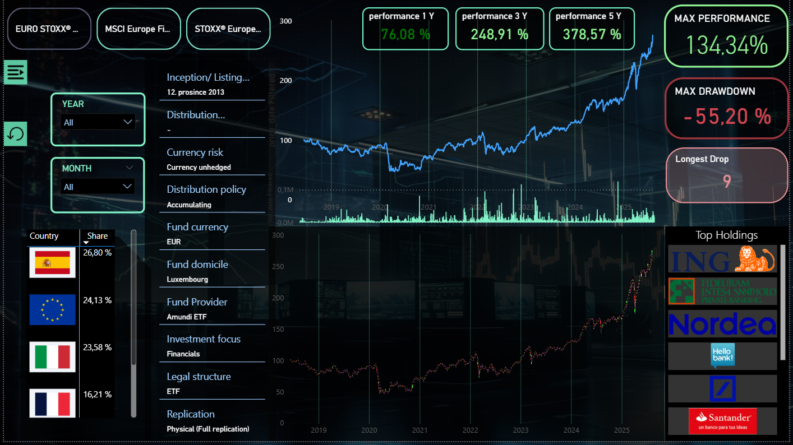

  
  
  
  
  

# ETF's Performance Dashboard (Power BI)

This project is an interactive **Power BI dashboard** focused on analyzing European ETF funds.
The dashboard allows users to track performance, risk, and key characteristics of ETFs,
and compare them both individually and across sectors.

## 📊 Dashboard Content

This project consists of **10 pages**:

- **Home page**

Introduction to ETFs, navigation menu, and links to all sections.

- **ETF Pages (per fund)**

Dedicated pages for each ETF with:

- two charts (price evolution, performance, candelstick chart, etc.),
- key performance indicators (performance, volatility, max drawdown),
- top holdings and share of participated countries
- reset button and navigation menu.

- **Candelstick Analyzer**

A bonus page to explore candlestick formations and identify potential trading patterns.

- **Summary page**

Comparison across sectors, performance & risk evaluation, Top 3 and Bottom 3 funds,
scatter plot visualization, and KPI indicators.

🛠️ **Key Features**

- Gethering, sorting and cleanig data
- **Python scripts**: for scraping data and some jpg. files
- **Data modeling**: multiple tables (price history, ETF metadata, date table, etc.).
- **DAX measures**: performance, CAGR, volatility, max drawdown, EMA, streak counter, performance for various periods (YTD, 3y, 5y, max).
- **Interactive navigation**: bookmarks, reset buttons, slicers for ISIN, year, month, and custom time periods.

🚀 **Main Metrics**

- **Performance (1y, 3y, 5y, Max)**
- **CAGR (Compound Annual Growth Rate)**
- **Volatility (annual & total)**
- **Max Drawdown**
- **Drop Streak (longest consecutive days of decline)**
- **Top 3 and Bottom 3 ETFs**

📷 **Visual**

